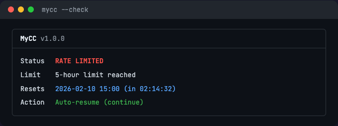

# MyCC (My Claude Code)

Quota monitor + countdown + auto-resume for Claude Code. One script, zero hassle.


[English](#features) | [中文](README_zh.md)

## Why?

Claude Code (Pro/Max) users hit rate limits constantly. When it happens:

1. You don't know **how much quota** you've used across each dimension
2. You don't know **exactly when** the limit resets
3. You have to **manually come back** and resume your work

MyCC solves all three: **monitor → countdown → auto-resume**.

## Features

- **Real-time quota monitoring** — See 5-hour, 7-day, and per-model usage at a glance
- **Precise countdown** — Know exactly when your limit resets, down to the second
- **Auto-resume** — Automatically continues your Claude Code session when the limit lifts
- **tmux integration** — `--launch` starts Claude Code with a live status bar at the bottom
- **Dual mode** — Basic (zero-config CLI detection) or Detailed (browser-sourced % breakdown)
- **Single file** — One shell script, ~1000 lines, zero dependencies for basic mode
- **macOS + Linux** — Works on both (auto-detects BSD/GNU tools)

## Install

```bash
# Download
curl -fsSL https://raw.githubusercontent.com/Web3ok/MyCC/main/mycc -o ~/.local/bin/mycc
chmod +x ~/.local/bin/mycc

# Or clone
git clone https://github.com/Web3ok/MyCC.git
cp MyCC/mycc ~/.local/bin/mycc
chmod +x ~/.local/bin/mycc
```

Requirements:
- **Basic mode**: No dependencies (bash, grep, perl — all pre-installed on macOS/Linux)
- **Detailed mode**: `jq` (`brew install jq` / `apt install jq`)
- **Launch mode**: `tmux` (`brew install tmux` / `apt install tmux`)

## Quick Start

### One-command launch (recommended)

```bash
# Start Claude Code with live status bar at bottom
mycc --launch

# Continue previous session + status bar
mycc --launch "-c"
```

This opens a tmux split — Claude Code on top, MyCC status bar on bottom:


### Manual usage

```bash
mycc --check              # One-shot status check
mycc                      # Wait for limit to lift, then auto-resume
mycc -n                   # Same, but start a new session
mycc -p "run tests"       # Auto-resume with custom prompt
mycc --no-resume          # Monitor only
mycc -d --check           # Detailed mode: see all quota percentages
```

## Two Modes

### Basic Mode (default)

Detects rate limits via the `claude` CLI. Zero configuration needed.

```bash
mycc --check
```



### Detailed Mode (`-d`)

Shows precise utilization percentages across all quota dimensions.

```bash
mycc -d --check
```


Requires a one-time setup:

```bash
mycc --setup
```

Detailed mode reads usage data from a local cache file (`~/.mycc-usage.json`).
To populate it, run a one-liner in your browser console at claude.ai (the setup wizard provides the exact command). Cloudflare blocks direct API calls from curl/scripts, so the browser acts as a trusted client.

You can also create a **bookmarklet** for one-click refresh:

```bash
mycc --bookmarklet
```

## Usage Reference

```
Usage: mycc [OPTIONS]

Modes:
  (no flag)            Basic mode - detect limits via claude CLI
  -d, --detailed       Detailed mode - browser-sourced utilization %

Auto-resume:
  -c, --continue       Continue previous conversation (default)
  -n, --new            Start new session when resuming
  -p, --prompt TEXT    Custom resume prompt (default: "continue")
  --no-resume          Monitor only, don't auto-resume
  -w, --watch          Keep watching after resume (loop mode)

Launch:
  --launch             Start tmux: Claude Code (top) + status bar (bottom)
  --launch "ARGS"      Same, but pass ARGS to claude (e.g. --launch "-c")

Configuration:
  --setup              Interactive setup wizard
  --org-id ID          Override organization ID (one-time)
  --refresh            Open browser to download fresh usage data
  --bookmarklet        Show bookmarklet for one-click refresh

Display:
  --compact            Single-line status bar (for tmux pane)
  --no-color           Disable ANSI colors
  --json               Output status as JSON
  --check              One-shot status check, then exit

Other:
  --test-mode SECS     Simulate rate limit (for testing)
  -h, --help           Show this help
  -v, --version        Show version
```

## Configuration

Config file: `~/.mycc.conf` (created by `mycc --setup`, permissions `600`)

| Field | Description | Default |
|-------|-------------|---------|
| ORG_ID | Claude.ai organization UUID | (from `--setup`) |
| RESUME_MODE | `continue` or `new` | `continue` |
| RESUME_PROMPT | Prompt sent when resuming | `continue` |
| REFRESH_INTERVAL | Compact mode refresh interval (seconds) | `120` |
| NOTIFY | macOS desktop notification on resume | `true` |

Usage data cache: `~/.mycc-usage.json` (auto-imported from `~/Downloads/mycc-usage.json`)

### How to refresh usage data

1. **Browser console**: Run the JS snippet from `mycc --bookmarklet` on any claude.ai page
2. **Bookmarklet**: Save the snippet as a browser bookmark for one-click refresh
3. The downloaded `mycc-usage.json` is auto-imported on next `mycc -d` run

## JSON Output

For scripting and tool integration:

```bash
mycc -d --check --json | jq .
```

```json
{
  "status": "ok",
  "five_hour":  { "pct": 75,  "resets_at": "2026-02-10T12:00:00Z" },
  "seven_day":  { "pct": 78,  "resets_at": "2026-02-14T23:00:00Z" },
  "sonnet":     { "pct": 12,  "resets_at": "2026-02-14T23:00:00Z" }
}
```

## Testing

```bash
mycc --test-mode 10              # Simulate 10s rate limit (basic)
mycc --test-mode 10 -d --check   # Simulate with detailed view
mycc --test-mode 30 -d --compact # Simulate compact status bar
mycc --test-mode 5 --json        # Simulate JSON output
```

## Security

- Config file is `chmod 600` (owner-only read/write)
- No API keys or session tokens stored — usage data is fetched via the browser
- Auto-resume uses `--dangerously-skip-permissions` — only use in trusted environments with trusted prompts
- No telemetry, no analytics, no outbound network calls from the script

## Inspired By

MyCC combines the best ideas from these open-source projects into a single, portable shell script:

| Project | Stars | What we took |
|---------|-------|--------------|
| [Claude-Code-Usage-Monitor](https://github.com/Maciek-roboblog/Claude-Code-Usage-Monitor) | 6.4k | Real-time token monitoring concept |
| [claude-auto-resume](https://github.com/terryso/claude-auto-resume) | 662 | Rate limit detection + auto-resume flow |
| [Usage4Claude](https://github.com/f-is-h/Usage4Claude) | 167 | claude.ai API integration for quota data |

## License

MIT
