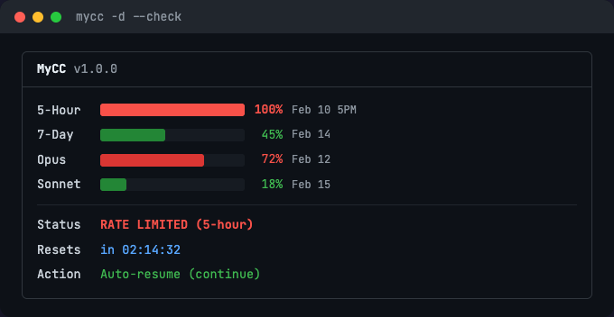
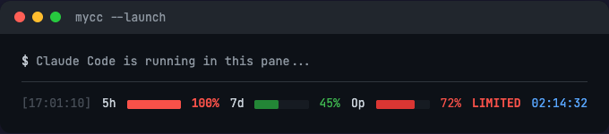

# MyCC (My Claude Code)

Claude Code 额度监控 + 倒计时 + 自动恢复，一站式解决限额焦虑。



## 它解决什么问题？

使用 Claude Code (Pro/Max) 时，经常遇到：

1. 用到一半突然触限，不知道还要等多久
2. 等了半天，忘了回来继续
3. 想知道各维度的额度用了多少

MyCC 把这三件事自动化：**监控 -> 倒计时 -> 自动恢复**。

## 安装

```bash
# 下载到 ~/bin（或任何在 PATH 中的目录）
cp mycc ~/bin/mycc
chmod +x ~/bin/mycc
```

依赖：
- **基础模式**：零依赖（bash + macOS 自带工具）
- **详细模式**：需要 `jq`（`brew install jq`）

## 快速开始

### 最常用：一键启动

```bash
# Claude Code + 底部实时状态栏（tmux 分屏）
mycc --launch

# 继续上次对话 + 状态栏
mycc --launch "-c"
```

效果：终端自动分屏，上方是 Claude Code，底部实时显示额度和倒计时：



### 手动使用

```bash
# 查看当前状态（一次性）
mycc --check

# 触限后挂起等待，限额恢复后自动继续上次对话
mycc

# 触限后挂起等待，自动开新会话
mycc -n

# 仅监控，不自动恢复
mycc --no-resume

# 持续监控模式
mycc -w --no-resume
```

## 两种运行模式

### 基础模式（默认）

通过 `claude` CLI 直接检测是否触限，解析重置时间。

```bash
mycc --check      # 检查一次
mycc              # 等待 + 自动恢复
```

- 零配置，开箱即用
- 只能看到"是否触限"和"何时恢复"
- 不需要浏览器 sessionKey

### 详细模式（`-d`）

调用 claude.ai API，获取所有维度的精确使用百分比。

```bash
mycc -d --check   # 查看各维度额度
mycc -d --launch  # 启动 Claude + 详细状态栏
```

显示 4 个维度：
| 维度 | 说明 |
|------|------|
| 5-Hour | 5 小时滚动窗口（最常触的限） |
| 7-Day | 7 天总额度 |
| Opus | 7 天 Opus 模型专用额度 |
| Sonnet | 7 天 Sonnet 模型专用额度 |

需要配置 sessionKey（见下文）。

## 配置详细模式

```bash
mycc --setup
```

按提示操作：

1. 在浏览器打开 https://claude.ai，确保已登录
2. 按 `Cmd+Option+I` 打开开发者工具
3. 进入 **Application** 标签页
4. 左侧 **Cookies** > **https://claude.ai**
5. 找到 `sessionKey`，复制它的 **Value**
6. 粘贴到终端

配置保存在 `~/.mycc.conf`（权限 600）。

## 全部命令参考

```
Usage: mycc [OPTIONS]

模式:
  (无参数)             基础模式 - 通过 claude CLI 检测限额
  -d, --detailed       详细模式 - 调用 claude.ai API

自动恢复:
  -c, --continue       继续上次对话（默认）
  -n, --new            新建会话
  -p, --prompt TEXT    自定义恢复 prompt（默认: "continue"）
  --no-resume          仅监控，不自动恢复
  -w, --watch          恢复后继续监控（循环模式）

启动:
  --launch             tmux 分屏：Claude Code（上）+ 状态栏（下）
  --launch "ARGS"      同上，传参给 claude（如 --launch "-c"）

配置:
  --setup              交互式配置向导
  --session-key KEY    临时覆盖 sessionKey
  --org-id ID          临时覆盖 orgId

显示:
  --compact            单行状态栏（用于 tmux 窗格）
  -q, --quiet          精简输出
  --no-color           禁用颜色
  --json               JSON 格式输出
  --check              检查一次后退出

其他:
  --test-mode SECS     模拟限额（测试用，SECS 秒后恢复）
  -h, --help           帮助
  -v, --version        版本
```

## 使用场景

### 场景 1：跑长任务怕触限

```bash
mycc --launch
```

底部状态栏实时显示额度。触限后自动等待倒计时，恢复后继续上次对话。

### 场景 2：触限了，想挂机等恢复

```bash
mycc
```

检测到限额 -> 显示倒计时 -> 恢复时间到 -> 自动用 `claude -c` 继续。

### 场景 3：触限了，恢复后执行特定任务

```bash
mycc -p "run all tests and fix failures"
```

### 场景 4：只想看看额度还剩多少

```bash
mycc -d --check
```

### 场景 5：在另一个终端标签持续监控

```bash
mycc -d --compact
```

### 场景 6：集成到脚本或工具链

```bash
status=$(mycc --json)
if echo "$status" | jq -r '.status' | grep -q limited; then
    echo "Claude Code is rate limited"
fi
```

## 配置文件

`~/.mycc.conf`（由 `--setup` 生成）：

```ini
# MyCC configuration
SESSION_KEY=sk-ant-sid01-...
ORG_ID=xxxxxxxx-xxxx-xxxx-xxxx-xxxxxxxxxxxx
RESUME_MODE=continue
RESUME_PROMPT=continue
REFRESH_INTERVAL=120
NOTIFY=true
```

| 字段 | 说明 | 默认值 |
|------|------|--------|
| SESSION_KEY | Claude.ai 浏览器 session cookie | （空，详细模式必需） |
| ORG_ID | 组织 ID（`--setup` 自动获取） | （空，自动发现） |
| RESUME_MODE | 恢复模式：`continue` 或 `new` | `continue` |
| RESUME_PROMPT | 恢复时发送的 prompt | `continue` |
| REFRESH_INTERVAL | 详细模式 API 刷新间隔（秒） | `120` |
| NOTIFY | 恢复时是否弹 macOS 通知 | `true` |

## 安全说明

- 配置文件权限自动设为 `600`（仅本人可读）
- sessionKey 存在本地，不会上传到任何地方
- 自动恢复使用 `--dangerously-skip-permissions` 标志，会跳过权限确认
- 建议仅在可信环境和可信 prompt 下使用自动恢复功能

## 技术细节

- 单文件 Shell 脚本，约 900 行
- macOS 原生兼容（BSD `date`，`perl` 替代 `timeout`）
- 也兼容 Linux（自动检测 GNU/BSD 工具链）
- tmux 集成：`--launch` 自动创建分屏会话
- 颜色编码：<50% 绿 / <70% 黄 / <90% 红 / >=90% 加粗红
- 错误处理：API 401 提示过期、403 提示 Cloudflare、429 自动退避

## 测试

```bash
# 模拟 10 秒限额（基础模式）
mycc --test-mode 10

# 模拟 10 秒限额（详细模式）
mycc --test-mode 10 -d --check

# 模拟限额 + 紧凑状态栏
mycc --test-mode 30 -d --compact

# JSON 输出测试
mycc --test-mode 5 --json | jq .
```

## 灵感来源

MyCC 融合了以下开源项目的核心思路：

- [Claude-Code-Usage-Monitor](https://github.com/Maciek-roboblog/Claude-Code-Usage-Monitor) (6.4k stars) — 实时 token 监控 + ML 预测
- [claude-auto-resume](https://github.com/terryso/claude-auto-resume) (662 stars) — 限额自动恢复
- [Usage4Claude](https://github.com/f-is-h/Usage4Claude) (167 stars) — macOS 菜单栏多维度额度监控

MyCC 用一个单文件 Shell 脚本将三者的核心能力整合在一起。

## License

MIT
